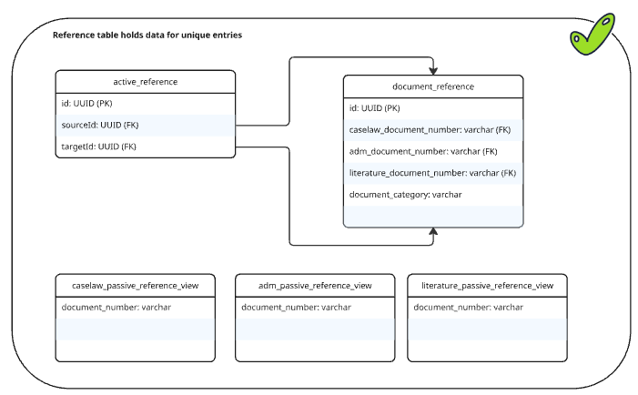

# ADR 0014: Centralized cross-schema referencing and asynchronous processing implementation specification

Date: 2026-01-13

## Status

Accepted

## Context

Our application architecture consists of multiple services (ADM & Literature, Caselaw, possibly more) that share a single database but process logic in their own schemas.
To satisfy the requirements of `Zitierungen`, documents in one schema need to reference documents in others (e.g., a literature entry citing an administrative regulation).
These references must be asynchronously processed in the respective services.

We identified the following requirements:
1.  **Referential Integrity:** Referenced documents must exist in their respective schemas.
2.  **Bi-directional Discovery:** Services must be able to identify both their outgoing (**active**) and incoming (**passive**) references.
3.  **Cross-Schema Communication:** Since schemas are isolated, we need a way to "bridge" them without giving every service user full access to every other schema.
4.  **Asynchronous Processing:** If a document's reference is updated, the service of the document's passive reference must process the change asynchronously. This should not block the main publication transaction in the other service.

## Decision

We have implemented a *centralized registry model* via the `references_schema`.

### 1. Database Design
The `references_schema` acts as the single source of truth for all references.
* **`document_reference` table:** A registry of all referenceable documents. It uses a `CHECK` constraint to ensure exactly one foreign key to a table in another schema (e.g., `adm.documentation_unit`) is populated.
* **`active_reference` table:** A table representing the directed reference (Source -> Target).
* **Passive Views:** For every document category, we provide a view (e.g., `adm_passive_reference`) that filters the global references for incoming links relevant only to that service.


### 2. Technical Implementation
* **Context Switching:** We use a `SchemaExecutor` to programmatically switch the `SchemaContextHolder` to the `REFERENCES` schema during the publication flow.
```
public void executeInSchema(SchemaType schema, Runnable action) {
  SchemaType originalSchema = SchemaContextHolder.getSchema();
  try {
    SchemaContextHolder.setSchema(schema);
    action.run();
  } finally {
    if (originalSchema != null) {
      SchemaContextHolder.setSchema(originalSchema);
    } else {
      SchemaContextHolder.clear();
    }
  }
}
```
```
schemaExecutor.executeInSchema(SchemaType.REFERENCES, () ->
  referenceService.publish(
    new DocumentReference(sli.documentNumber(), sli.documentCategory()),
    targets
  )
);
```
* **Transaction Isolation:** The `ReferencesService.publish` method uses `@Transactional(propagation = Propagation.REQUIRES_NEW)`. This ensures that reference registration happens independently of the document's transaction state.
* **Permission Model:** A specific `references_schema` user owns the central registry. This user has `REFERENCES` permissions on the services tables to create FKs, while the users of the services have access to the registry's views.

### 3. Asynchronous Mechanic
To process the consequences of new references, a background process - implemented via Spring @Scheduled or a CronJob - continuously
checks the passive views for updates. When detecting a change, this process triggers the necessary internal logic within
the service that owns the cited document, i.e., adding the passive reference to the document. This mechanism ensures that the system remains consistent. This maintains
strict decoupling, as the citing service is never required for the operations of the service being cited.

### 4. Deletion/Unpublishing & Updating
- Unpublishing: To unpublish references, the publish method is called with an empty list of targets. This removes records from active_references.
- Updating: Updated references will be overwritten by the publish call.

## Consequences

* **Consistency:** Database-level FKs ensure that we cannot reference a document that does not exist or has been deleted.
* **Service Integration:** New services can be integrated by updating the registry schema and adding a new passive view.
* **Operational Dependency:** If a service is not yet deployed in certain environments, the FK constraints to that service must be omitted or handled as "soft" references until the schema is available.

---

## Ownerships of Tables Overview

The integrity of the centralized registry relies on a strict division of data ownership and access rights.
The `references_schema` (owned by `references_schema` user) maintains the global index of all referenceable entities.
While the respective documentation unit owners (e.g. `adm` or `literature`) have full ownership and control over their respective tables,
they grant `SELECT` and `REFERENCES` permissions to the `references_schema` user to enable cross-schema foreign keys.
Conversely, the documentation unit users are granted read-only access to the passive views within the registry schema,
allowing them to access referencing citations without gaining direct access to the internal data of other services.

| Component / Table                                      | Schema Owner                 | Authorized Users              | Access Level           |
|:-------------------------------------------------------|:-----------------------------|:------------------------------|:-----------------------|
| **Registry Tables** (`document_reference`)             | `references_schema`          | `adm`, `literature` `caselaw` | Full access            |
| **Active Links** (`active_reference`)                  | `references_schema`          | `adm`, `literature` `caselaw` | Full access            |
| **Service Documents** (e.g., `adm.documentation_unit`) | `adm` `literature` `caselaw` | `references_schema`           | `REFERENCES` (for FKs) |
| **Passive Views** (e.g., `adm_passive_reference`)      | `references_schema`          | `adm`, `literature` `caselaw` | `SELECT`               |

---

### Open Question:
- How to handle references without a document number?
- how to deal with changes in the referenced documents?
