<!-- Additional Macros (based on context diagram macros):
    Container(alias, label, ?techn, ?descr, ?sprite, ?tags, ?link, ?baseShape)
    ContainerDb(alias, label, ?techn, ?descr, ?sprite, ?tags, ?link)
    ContainerQueue(alias, label, ?techn, ?descr, ?sprite, ?tags, ?link)
    Container_Ext(alias, label, ?techn, ?descr, ?sprite, ?tags, ?link, ?baseShape)
    ContainerDb_Ext(alias, label, ?techn, ?descr, ?sprite, ?tags, ?link)
    ContainerQueue_Ext(alias, label, ?techn, ?descr, ?sprite, ?tags, ?link)
    Container_Boundary(alias, label, ?tags, ?link)
 -->

```mermaid
C4Container
    title RIS-VwV, Container Diagram with Migration via CLI and Backend 🚧 Work in Progress! 🚧

    Person_Ext("documentalist", "BSG Documentalist", "BSG staff member, various roles")

    Person_Ext("neurisPerson", "NeuRIS staff", "Member of the VwV team")
    Container_Ext("localDisk", "Local Disk", "Harddrive containing BSG dump")
    Rel("neurisPerson", "localDisk", "Reads from disk")

    System_Boundary("ris-vwv", "RIS-VwV"){
        Container("frontend", "Single Page Web App", "Vue, TypeScript", "Provides all RIS-VwV functionality to <br>users via their web browser")
        Rel("documentalist", "frontend", "Accesses to create and adjust VwVs")

        Container("backend", "API Server", "Java, Spring Boot", "Provides functionality via a HTTPS/JSON API")
        Rel("frontend", "backend", "Makes API calls to", "HTTPS/JSON")

        ContainerDb("relationalDB", "NeuRIS Relational DB", "PostgreSQL", "Store process data")
        Rel("backend", "relationalDB", "Reads from and writes to", "SQL/TCP")

        ContainerDb("sessionStorage", "Session Storage", "Redis", "Stores user session information")
        Rel("backend", "sessionStorage", "reads from and writes to", "HTTPS")

        Container("fileStorage", "File Storage", "??? but already exists<br> in the NeuRIS space" "Stores published VwV")
        Rel("backend", "fileStorage", "Stores published VwV", "HTTPS")

        Container("migrationCLI", "Migration CLI", "Java", "Transforms old VwV")
        Rel("neurisPerson", "migrationCLI", "Runs locally")
        Rel("migrationCLI", "backend", "sends", "HTTPS/JSON")

    }

    Container_Ext("portal", "Portal", "Gives the public access to norms")
    Rel("portal", "fileStorage", "Reads VwV")

    UpdateLayoutConfig($c4ShapeInRow="3", $c4BoundaryInRow="1")
```

