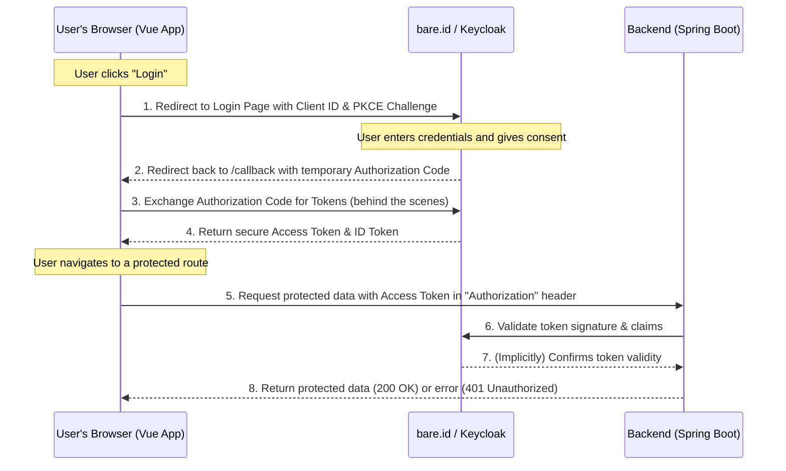

```mermaid
sequenceDiagram
    participant User's Browser (Vue App)
    participant bare.id / Keycloak
    participant Backend (Spring Boot)

    Note over User's Browser (Vue App): User clicks "Login"
    User's Browser (Vue App)->>bare.id / Keycloak: 1. Redirect to Login Page with Client ID & PKCE Challenge

    Note over bare.id / Keycloak: User enters credentials and gives consent
    bare.id / Keycloak-->>User's Browser (Vue App): 2. Redirect back to /callback with temporary Authorization Code

    User's Browser (Vue App)->>bare.id / Keycloak: 3. Exchange Authorization Code for Tokens (behind the scenes)
    bare.id / Keycloak-->>User's Browser (Vue App): 4. Return secure Access Token & ID Token

    Note over User's Browser (Vue App): User navigates to a protected route

    User's Browser (Vue App)->> Backend (Spring Boot): 5. Request protected data with Access Token in "Authorization" header

    Backend (Spring Boot)->>bare.id / Keycloak: 6. Validate token signature & claims
    bare.id / Keycloak-->> Backend (Spring Boot): 7. (Implicitly) Confirms token validity

    Backend (Spring Boot)-->>User's Browser (Vue App): 8. Return protected data (200 OK) or error (401 Unauthorized)
```
