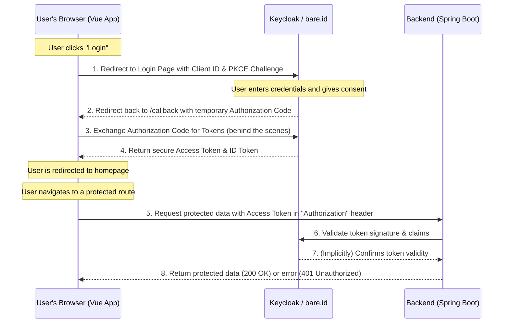

# Authorization flow

As an authorization flow we use Oauth 2 with PKCE (Proof Key for Code Exchange), PKCE is recommended for all OAuth 2.0 flows involving public clients to provide an additional layer of security. It is supported by many identity providers and is considered a best practice for securing OAuth 2.0 implementations in public client applications.

As an authorization service we use Keycloak locally, an open-source identity and access management solution widely used for adding authentication and authorization to applications. On the server we use [Bare.ID](https://www.bare.id/).

